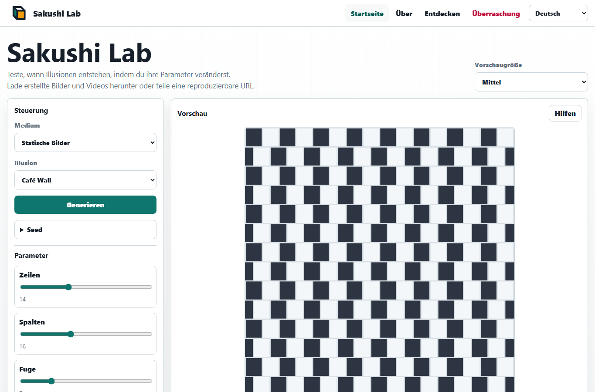
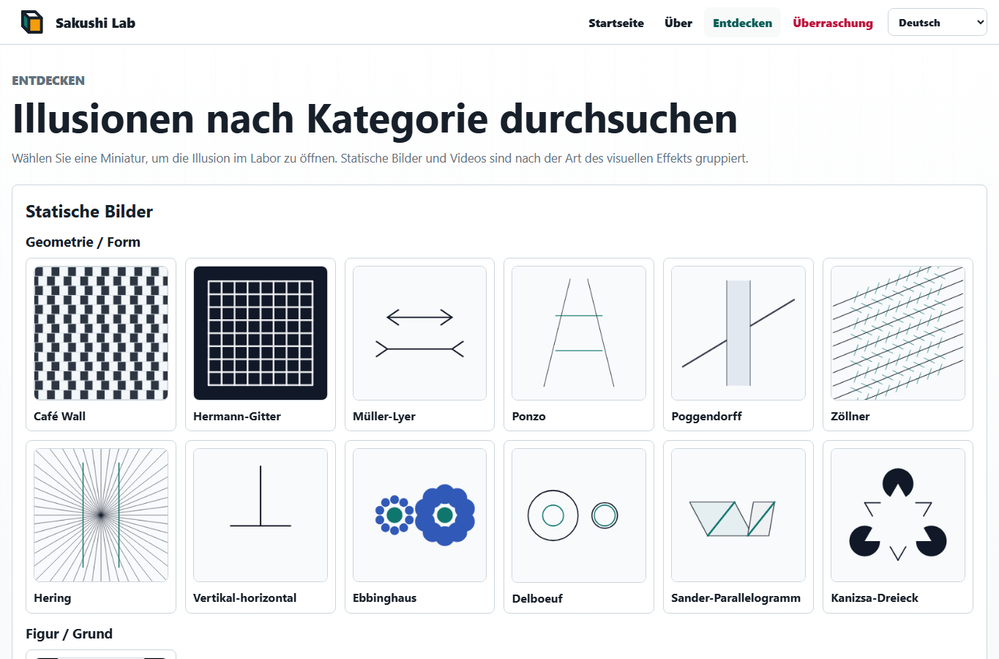

# Sakushi Lab

Sakushi Lab ist ein statischer, mehrsprachiger Spielplatz für visuelle Illusionen. Die App läuft vollständig im Browser mit Vite, Vanilla TypeScript, Canvas, SVG-Export und WebM-Aufnahme.

Live-Site: [Sakushi Lab](https://piccoripico.github.io/sakushi-lab/)

## Mehrsprachige Dokumente

- [English](../README.md)
- [日本語](README.ja.md)
- [Français](README.fr.md)
- [Español](README.es.md)
- [简体中文](README.zh-Hans.md)
- [繁體中文](README.zh-Hant.md)
- [한국어](README.ko.md)

## Screenshots

### Startseite



### Explore



## Über Visuelle Illusionen

Visuelle Illusionen sind Bilder oder Bewegungsmuster, die zeigen, wie stark Wahrnehmung vom Kontext abhängt. Physikalisch parallele Linien können geneigt erscheinen, gleiche Formen können unterschiedlich groß wirken, und unbewegte Muster können flimmern oder sich zu bewegen scheinen.

Diese Effekte sind nicht einfach "Fehler" des Sehens. Sie zeigen, wie das visuelle System Helligkeit, Kontrast, Tiefe, Richtung, Größe und Bewegung aus umgebenden Informationen schätzt. Mit Sakushi Lab lassen sich die Bedingungen jeder Illusion verändern, um zu sehen, wann der Effekt stärker, schwächer oder leichter bemerkbar wird.

Die erzeugten Bilder und Videos eignen sich für Lernen, Demonstrationen, Designexperimente und neugieriges Erkunden. Einige Bewegungsillusionen können intensiv wirken; machen Sie eine Pause, wenn eine Animation unangenehm wird.

## Funktionen

- 18 visuelle Illusionen:
  - Statische Bilder
    - Geometrie / Form:
      - Café Wall: versetzte Kacheln lassen parallele Linien geneigt erscheinen.
      - Hermann-Gitter: Gitterkreuzungen erzeugen flüchtige dunkle Flecken.
      - Müller-Lyer: Pfeilflügel verändern die wahrgenommene Länge gleicher Linien.
      - Ponzo: Perspektivhinweise lassen gleiche Balken unterschiedlich wirken.
      - Poggendorff: ein verdeckender Streifen lässt eine Diagonale versetzt erscheinen.
      - Zöllner: kreuzende Kurzstriche lassen Parallelen geneigt erscheinen.
      - Hering: strahlenförmige Linien lassen gerade Parallelen nach außen gebogen wirken.
      - Vertikal-Horizontal: gleiche vertikale und horizontale Linien wirken ungleich.
      - Ebbinghaus: umgebende Kreise verändern die wahrgenommene Größe gleicher Zentren.
      - Delboeuf: umgebende Ringe verändern die wahrgenommene Größe gleicher Kreise.
      - Sander-Parallelogramm: schräge Rahmen verzerren die wahrgenommene Linienlänge.
      - Kanizsa-Dreieck: ausgesparte Scheiben und Eckformen deuten ein nicht gezeichnetes Dreieck an.
    - Figur / Grund:
      - Rubins Vase: eine Vase und zwei Gesichtsprofile konkurrieren als Figur und Grund.
    - Farbe / Helligkeit:
      - Simultankontrast: identische Farben ändern sich durch ihre Umgebung.
      - White-Illusion: gleiche Grautöne wirken auf Streifen verschieden.
      - Cornsweet: eine schmale Schattenkante verändert die wahrgenommene Helligkeit.
  - Videos
    - Bewegung / Nachbilder:
      - Lilac Chaser: eine rotierende Lücke erzeugt ein bewegtes Nachbildgefühl.
    - Umkehrbare Tiefe:
      - Hohle Maske: Hinweise eines konkaven Gesichts können als vorspringendes Gesicht erscheinen.
      - Rotierender Necker-Würfel: Bewegung lässt den Drahtwürfel in der Tiefe kippen.
- Parametersteuerungen werden aus dem Schema jedes Illusionsmoduls erzeugt.
- Optionale Seed-Steuerung für reproduzierbare Erzeugung.
- Deterministische Erzeugung mit seedbasierter URL-Freigabe.
- Export als PNG, SVG, WebM und reproduzierbare URL.
- UI-Sprachen: Englisch, Französisch, Spanisch, Deutsch, Japanisch, Vereinfachtes Chinesisch, Traditionelles Chinesisch und Koreanisch.

## Entwicklung

```powershell
npm.cmd install
npm.cmd run verify
```

Nützliche Skripte:

- `npm.cmd run dev`: startet den Vite-Entwicklungsserver.
- `npm.cmd test`: führt Unit-Tests aus.
- `npm.cmd run build`: prüft Typen und baut `dist/`.
- `npm.cmd run test:e2e`: führt Playwright-Tests aus.

## GitHub Pages

Der Workflow in `.github/workflows/pages.yml` baut `dist/` und lädt es bei Pushes auf `main` oder manuellem Start als Pages-Artefakt hoch.
