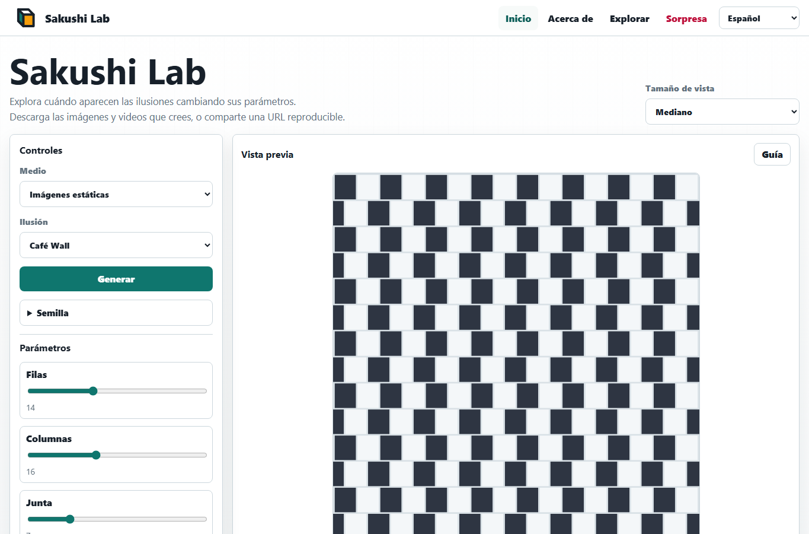
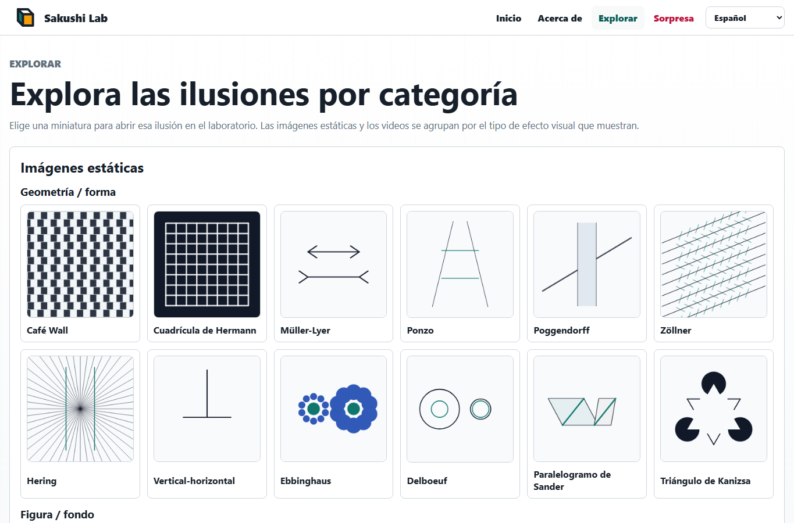

# Sakushi Lab

Sakushi Lab es un laboratorio estático y multilingüe para explorar ilusiones visuales. Funciona completamente en el navegador con Vite, TypeScript vanilla, Canvas, exportación SVG y grabación WebM.

Sitio en línea: [Sakushi Lab](https://piccoripico.github.io/sakushi-lab/)

## Documentos Multilingües

- [English](../README.md)
- [日本語](README.ja.md)
- [Français](README.fr.md)
- [Deutsch](README.de.md)
- [简体中文](README.zh-Hans.md)
- [繁體中文](README.zh-Hant.md)
- [한국어](README.ko.md)

## Capturas De Pantalla

### Inicio



### Explorar



## Sobre Las Ilusiones Visuales

Las ilusiones visuales son imágenes o patrones de movimiento que muestran cuánto depende la percepción del contexto. Líneas físicamente paralelas pueden parecer inclinadas, formas iguales pueden verse de tamaños distintos y patrones estáticos pueden parecer vibrar o moverse.

Estos efectos no son simples "errores" de la vista. Muestran cómo el sistema visual estima brillo, contraste, profundidad, dirección, tamaño y movimiento a partir de la información que lo rodea. Sakushi Lab permite cambiar las condiciones de cada ilusión y observar cómo el efecto se vuelve más fuerte, más débil o más fácil de notar.

Las imágenes y videos generados sirven para aprendizaje, demostraciones, experimentos de diseño y exploración casual. Algunas ilusiones con movimiento pueden sentirse intensas, así que toma un descanso si una animación resulta incómoda.

## Funciones

- 18 ilusiones visuales:
  - Imágenes estáticas
    - Geometría / forma:
      - Café Wall: baldosas desplazadas hacen que líneas paralelas parezcan inclinadas.
      - Cuadrícula de Hermann: las intersecciones de la cuadrícula crean manchas oscuras fugaces.
      - Müller-Lyer: las aletas cambian la longitud percibida de líneas iguales.
      - Ponzo: las claves de perspectiva hacen que barras iguales parezcan distintas.
      - Poggendorff: una banda que oculta hace que una diagonal parezca desplazada.
      - Zöllner: trazos cruzados hacen que líneas paralelas parezcan inclinarse.
      - Hering: líneas radiales hacen que paralelas rectas parezcan curvarse hacia afuera.
      - Vertical-Horizontal: segmentos verticales y horizontales iguales se sienten desiguales.
      - Ebbinghaus: los círculos circundantes cambian el tamaño percibido de centros iguales.
      - Delboeuf: los anillos circundantes cambian el tamaño percibido de círculos iguales.
      - Paralelogramo de Sander: marcos inclinados distorsionan la longitud percibida.
      - Triángulo de Kanizsa: discos recortados y esquinas sugieren un triángulo que no está dibujado.
    - Figura / fondo:
      - Jarrón de Rubin: un jarrón y dos perfiles faciales compiten como figura y fondo.
    - Color / brillo:
      - Contraste simultáneo: colores idénticos cambian con su entorno.
      - Ilusión de White: grises iguales parecen distintos sobre rayas.
      - Cornsweet: un borde sombreado estrecho cambia el brillo percibido.
  - Videos
    - Movimiento / patrones de posimagen:
      - Lilac Chaser: un hueco giratorio produce una sensación de posimagen móvil.
    - Profundidad reversible:
      - Cubo de Necker giratorio: el movimiento hace que el cubo cambie de profundidad.
- Controles de parámetros generados desde el esquema de cada módulo de ilusión.
- Controles opcionales de semilla para generación reproducible.
- Generación determinista con URL compartibles basadas en semilla.
- Exportación PNG, SVG, WebM y URL reproducible.
- Idiomas de la interfaz: inglés, francés, español, alemán, japonés, chino simplificado, chino tradicional y coreano.

## Desarrollo

```powershell
npm.cmd install
npm.cmd run verify
```

Scripts útiles:

- `npm.cmd run dev`: inicia el servidor de desarrollo de Vite.
- `npm.cmd test`: ejecuta las pruebas unitarias.
- `npm.cmd run build`: verifica tipos y construye `dist/`.
- `npm.cmd run test:e2e`: ejecuta las pruebas de Playwright.

## GitHub Pages

El workflow de `.github/workflows/pages.yml` construye y sube `dist/` como artefacto de Pages al hacer push a `main` o al ejecutarse manualmente.
