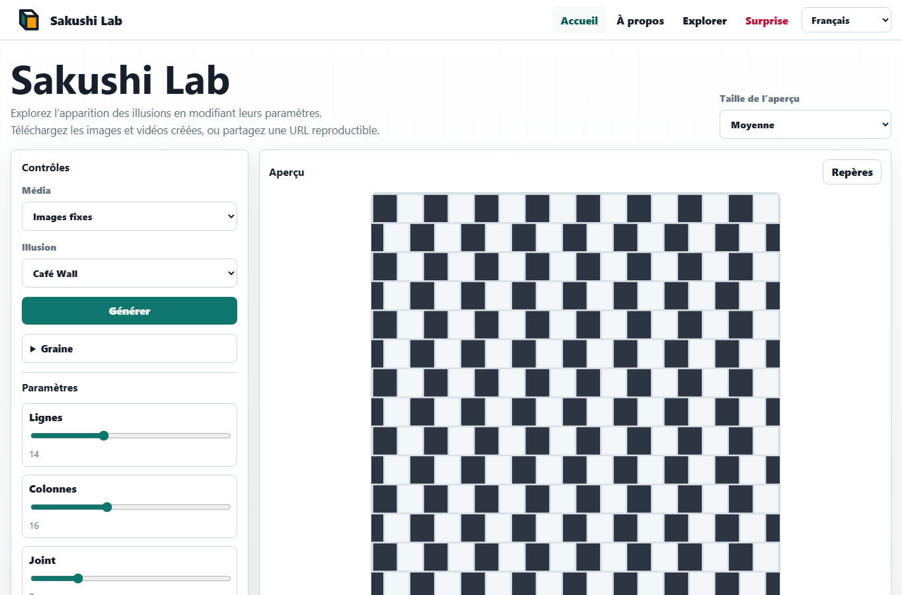
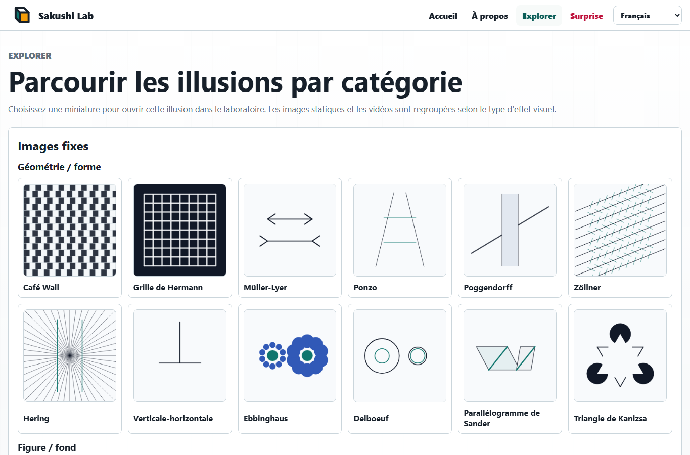

# Sakushi Lab

Sakushi Lab est un terrain de jeu statique et multilingue pour les illusions visuelles. Il fonctionne entièrement dans le navigateur avec Vite, TypeScript vanilla, Canvas, l'export SVG et l'enregistrement WebM.

Site en ligne : [Sakushi Lab](https://piccoripico.github.io/sakushi-lab/)

## Documents Multilingues

- [English](../README.md)
- [日本語](README.ja.md)
- [Español](README.es.md)
- [Deutsch](README.de.md)
- [简体中文](README.zh-Hans.md)
- [繁體中文](README.zh-Hant.md)
- [한국어](README.ko.md)

## Captures D'écran

### Accueil



### Explorer



## À Propos Des Illusions Visuelles

Les illusions visuelles sont des images ou des motifs en mouvement qui montrent à quel point la perception dépend du contexte. Des lignes physiquement parallèles peuvent sembler inclinées, des formes identiques peuvent paraître de tailles différentes, et des motifs immobiles peuvent donner l'impression de scintiller ou de bouger.

Ces effets ne sont pas de simples « erreurs » de vision. Ils montrent comment le système visuel estime la luminosité, le contraste, la profondeur, la direction, la taille et le mouvement à partir des informations environnantes. Sakushi Lab permet de modifier les conditions de chaque illusion et d'observer comment ces changements rendent l'effet plus fort, plus faible ou plus facile à remarquer.

Les images et vidéos générées peuvent servir à l'apprentissage, aux démonstrations, aux expériences de design et à l'exploration personnelle. Certaines illusions animées peuvent être intenses ; faites une pause si une animation devient inconfortable.

## Fonctionnalités

- 18 illusions visuelles :
  - Images statiques
    - Géométrie / forme :
      - Café Wall : des tuiles décalées font paraître inclinées des lignes parallèles.
      - Grille de Hermann : les intersections du quadrillage créent des taches sombres fugitives.
      - Müller-Lyer : des ailettes modifient la longueur perçue de lignes égales.
      - Ponzo : des indices de perspective font paraître différentes des barres égales.
      - Poggendorff : une bande masquante fait sembler décalée une diagonale.
      - Zöllner : de petits traits croisés font paraître inclinées des lignes parallèles.
      - Hering : des lignes rayonnantes courbent visuellement des parallèles vers l'extérieur.
      - Verticale-horizontale : des lignes verticale et horizontale égales semblent inégales.
      - Ebbinghaus : les cercles autour changent la taille perçue des centres égaux.
      - Delboeuf : les anneaux autour changent la taille perçue de cercles égaux.
      - Parallélogramme de Sander : des cadres inclinés déforment la longueur perçue.
      - Triangle de Kanizsa : des disques évidés et des angles suggèrent un triangle non dessiné.
    - Figure / fond :
      - Vase de Rubin : un vase et deux profils de visage se disputent le rôle de figure et de fond.
    - Couleur / luminosité :
      - Contraste simultané : une même couleur change avec son entourage.
      - Illusion de White : des gris égaux semblent différents sur des rayures.
      - Cornsweet : une fine bordure ombrée change la luminosité perçue.
  - Vidéos
    - Mouvement / images rémanentes :
      - Chasseur lilas : un vide tournant produit une sensation d'image rémanente.
    - Profondeur réversible :
      - Cube de Necker rotatif : le mouvement fait basculer le cube en profondeur.
- Contrôles de paramètres générés depuis le schéma de chaque module d'illusion.
- Contrôles optionnels de graine pour une génération reproductible.
- Génération déterministe avec partage d'URL basé sur une graine.
- Export PNG, SVG, WebM et URL reproductible.
- Langues de l'interface : anglais, français, espagnol, allemand, japonais, chinois simplifié, chinois traditionnel et coréen.

## Développement

```powershell
npm.cmd install
npm.cmd run verify
```

Scripts utiles :

- `npm.cmd run dev` : démarre le serveur de développement Vite.
- `npm.cmd test` : exécute les tests unitaires.
- `npm.cmd run build` : vérifie les types et construit `dist/`.
- `npm.cmd run test:e2e` : exécute les tests Playwright.

## GitHub Pages

Le workflow dans `.github/workflows/pages.yml` construit et téléverse `dist/` comme artefact Pages lors des pushs vers `main` ou d'un déclenchement manuel.
