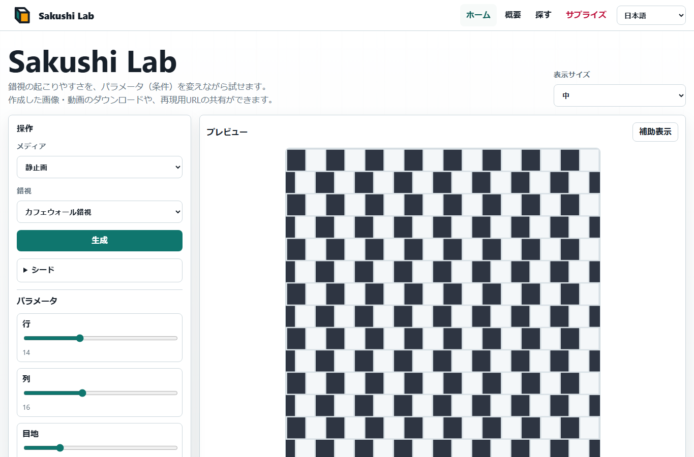
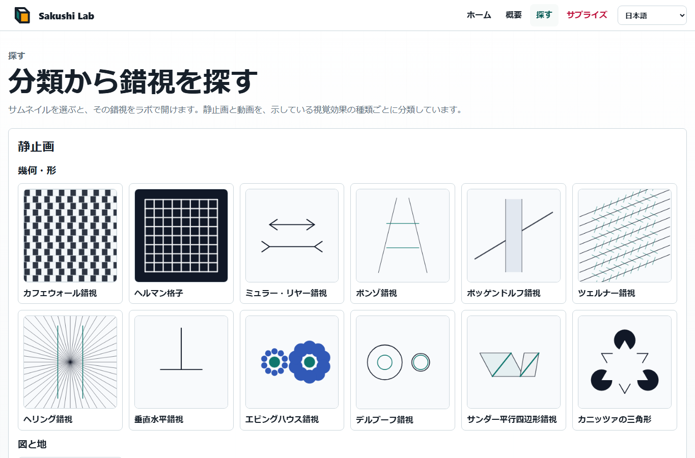

# Sakushi Lab

Sakushi Lab は、静的で多言語対応の視覚錯視プレイグラウンドです。Vite、vanilla TypeScript、Canvas、SVG書き出し、WebM録画を使い、すべてブラウザ内で動作します。

公開サイト: [Sakushi Lab](https://piccoripico.github.io/sakushi-lab/)

## 多言語ドキュメント

- [English](../README.md)
- [Français](README.fr.md)
- [Español](README.es.md)
- [Deutsch](README.de.md)
- [简体中文](README.zh-Hans.md)
- [繁體中文](README.zh-Hant.md)
- [한국어](README.ko.md)

## スクリーンショット

### Home



### Explore



## 視覚錯視について

視覚錯視は、ものの見え方が周囲の条件や文脈に強く影響されることを示す画像や動きのパターンです。物理的には平行な線が傾いて見えたり、同じ大きさの図形が違う大きさに見えたり、静止した模様が揺れたり動いたりするように感じられることがあります。

これらは単なる「目の誤り」ではありません。明るさ、コントラスト、奥行き、方向、大きさ、動きなどを、視覚システムが周囲の情報から推定していることを示しています。Sakushi Lab では、各錯視の条件を変えながら、効果が強くなる、弱くなる、気づきやすくなる様子を試せます。

作成した画像や動画は、学習、デモ、デザイン実験、気軽な探索に利用できます。動きのある錯視は刺激が強く感じられることがあるため、不快に感じた場合は休憩してください。

## 機能

- 18種類の視覚錯視:
  - 静止画
    - 幾何 / 形:
      - カフェウォール錯視: ずれたタイル列により、平行線が傾いて見えます。
      - ヘルマン格子: 格子の交点に一瞬の暗い点が見えます。
      - ミュラー・リヤー錯視: 矢羽により、同じ長さの線が違って見えます。
      - ポンゾ錯視: 遠近の手がかりで、同じ棒が違う大きさに見えます。
      - ポッゲンドルフ錯視: 遮る帯により、斜線がずれて見えます。
      - ツェルナー錯視: 交差する短線により、平行線が傾いて見えます。
      - ヘリング錯視: 放射状の線により、平行線が外側へ曲がって見えます。
      - 垂直水平錯視: 同じ長さの縦線と横線が違って感じられます。
      - エビングハウス錯視: 周囲の円が中心円の大きさの見え方を変えます。
      - デルブーフ錯視: 周囲の輪が同じ円の大きさの見え方を変えます。
      - サンダー平行四辺形錯視: 傾いた枠が線分の長さの見え方を歪めます。
      - カニッツァの三角形: 欠けた円と角型図形から、描かれていない三角形が見えます。
    - 図と地:
      - ルビンの壺: 壺と2つの横顔が、図と地として入れ替わって見えます。
    - 色 / 明るさ:
      - 同時対比: 同じ色が周囲によって違う明るさに見えます。
      - ホワイト錯視: 同じ灰色が縞の上で違って見えます。
      - コーンスウィート錯視: 細い陰影の境目で明るさが違って見えます。
  - 動画
    - 動き / 残像パターン:
      - ライラックチェイサー: 回る欠けが動く残像の感覚を作ります。
    - 反転する奥行き:
      - 回転ネッカーキューブ: 動きにより線画立方体の奥行き解釈が反転します。
- 各錯視モジュールのスキーマから生成されるパラメータ操作。
- 再現性のある生成のための任意のシード操作。
- シード付きURL共有による決定的な生成。
- PNG、SVG、WebM、再現用URLの出力。
- UI言語: 英語、フランス語、スペイン語、ドイツ語、日本語、簡体字中国語、繁体字中国語、韓国語。

## 開発

```powershell
npm.cmd install
npm.cmd run verify
```

便利なスクリプト:

- `npm.cmd run dev`: Vite 開発サーバを起動します。
- `npm.cmd test`: ユニットテストを実行します。
- `npm.cmd run build`: 型チェックと `dist/` のビルドを実行します。
- `npm.cmd run test:e2e`: Playwright テストを実行します。

## GitHub Pages

`.github/workflows/pages.yml` のワークフローは、`main` へのpushまたは手動実行時に `dist/` をビルドし、Pages artifact としてアップロードします。
