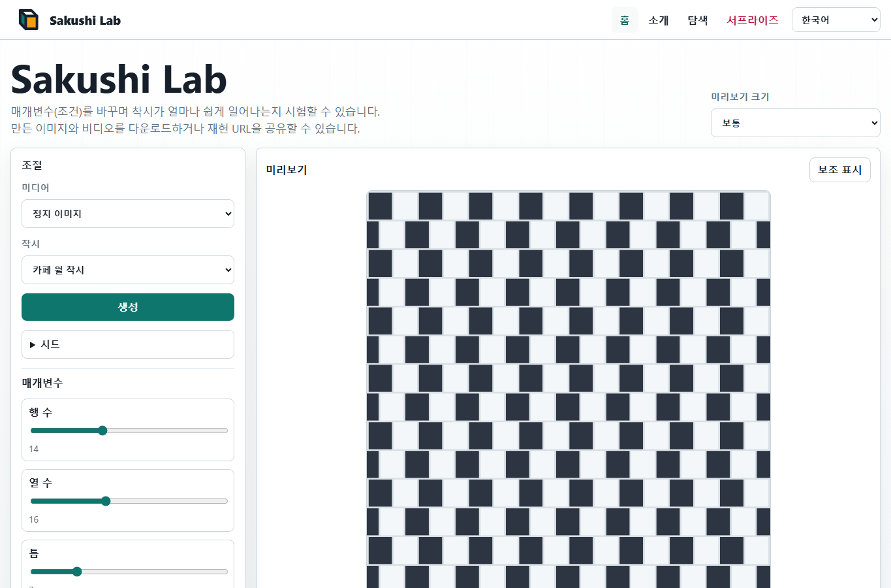
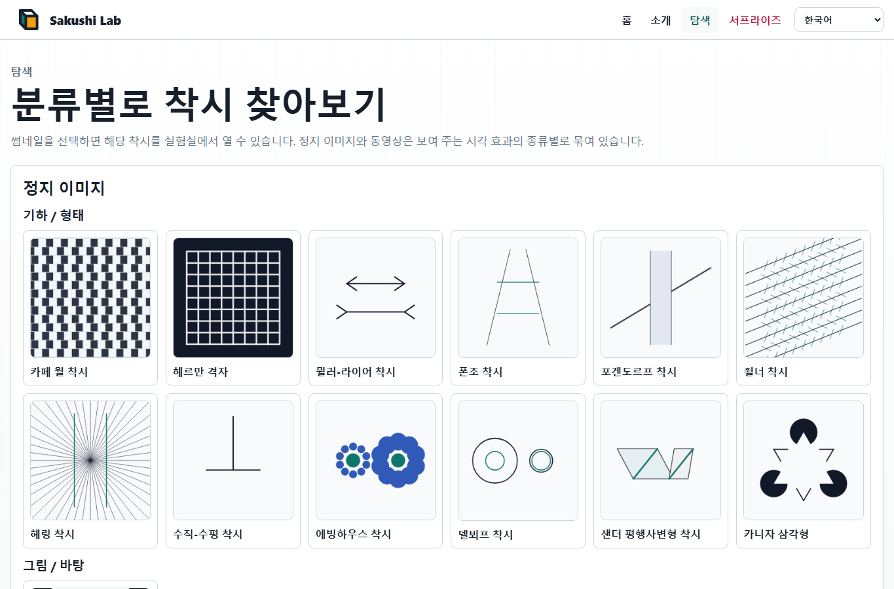

# Sakushi Lab

Sakushi Lab은 정적 다국어 시각 착시 실험장입니다. Vite, vanilla TypeScript, Canvas, SVG 내보내기, WebM 녹화를 사용하며 모든 기능은 브라우저 안에서 동작합니다.

라이브 사이트: [Sakushi Lab](https://piccoripico.github.io/sakushi-lab/)

## 다국어 문서

- [English](../README.md)
- [日本語](README.ja.md)
- [Français](README.fr.md)
- [Español](README.es.md)
- [Deutsch](README.de.md)
- [简体中文](README.zh-Hans.md)
- [繁體中文](README.zh-Hant.md)

## 스크린샷

### Home



### Explore



## 시각 착시에 대하여

시각 착시는 지각이 주변 조건과 맥락에 얼마나 크게 의존하는지 보여 주는 이미지나 움직임 패턴입니다. 실제로는 평행한 선이 기울어 보이거나, 같은 크기의 도형이 다르게 보이거나, 정지한 무늬가 흔들리거나 움직이는 것처럼 느껴질 수 있습니다.

이러한 효과는 단순한 시각의 “오류”가 아닙니다. 시각 시스템이 밝기, 대비, 깊이, 방향, 크기, 움직임을 주변 정보로부터 추정한다는 사실을 보여 줍니다. Sakushi Lab에서는 각 착시의 조건을 바꾸며 효과가 강해지거나 약해지거나 더 쉽게 보이는 방식을 확인할 수 있습니다.

생성한 이미지와 동영상은 학습, 시연, 디자인 실험, 가벼운 탐색에 사용할 수 있습니다. 움직임 착시는 자극이 강하게 느껴질 수 있으므로 불편하면 잠시 쉬어 주세요.

## 기능

- 18가지 시각 착시:
  - 정지 이미지
    - 기하 / 형태:
      - 카페 월 착시: 어긋난 타일 배열 때문에 평행선이 기울어 보입니다.
      - 헤르만 격자: 격자 교차점에 순간적인 어두운 점이 보입니다.
      - 뮐러-라이어 착시: 화살 깃이 같은 선분의 지각 길이를 바꿉니다.
      - 폰조 착시: 원근 단서 때문에 같은 막대가 다른 크기로 보입니다.
      - 포겐도르프 착시: 가리는 띠 때문에 사선이 어긋나 보입니다.
      - 죌너 착시: 교차하는 짧은 선들이 평행선을 기울어 보이게 합니다.
      - 헤링 착시: 방사형 선들이 곧은 평행선을 바깥쪽으로 휘어 보이게 합니다.
      - 수직-수평 착시: 같은 길이의 수직선과 수평선이 다르게 느껴집니다.
      - 에빙하우스 착시: 주변 원이 중심 원의 지각 크기를 바꿉니다.
      - 델보프 착시: 주변 고리가 같은 원의 지각 크기를 바꿉니다.
      - 샌더 평행사변형 착시: 기울어진 틀이 선분 길이의 느낌을 왜곡합니다.
      - 카니자 삼각형: 잘린 원과 모서리 도형이 실제로 그려지지 않은 삼각형을 암시합니다.
    - 그림 / 바탕:
      - 루빈의 꽃병: 꽃병과 두 옆얼굴이 그림과 바탕으로 경쟁합니다.
    - 색 / 밝기:
      - 동시 대비: 같은 색이 주변에 따라 다른 밝기로 보입니다.
      - 화이트 착시: 같은 회색 막대가 줄무늬 위에서 다르게 보입니다.
      - 콘스위트 착시: 좁은 음영 경계가 밝기 지각을 바꿉니다.
  - 동영상
    - 움직임 / 잔상 패턴:
      - 라일락 체이서: 회전하는 빈자리가 움직이는 잔상 느낌을 만듭니다.
    - 반전되는 깊이:
      - 회전 네커 큐브: 움직임이 선화 큐브의 깊이 해석 반전을 드러냅니다.
- 각 착시 모듈의 schema에서 생성되는 파라미터 조작.
- 재현 가능한 생성을 위한 선택적 시드 조작.
- 시드 기반 URL 공유를 통한 결정적 생성.
- PNG, SVG, WebM, 재현용 URL 내보내기.
- UI 언어: 영어, 프랑스어, 스페인어, 독일어, 일본어, 중국어 간체, 중국어 번체, 한국어.

## 개발

```powershell
npm.cmd install
npm.cmd run verify
```

유용한 스크립트:

- `npm.cmd run dev`: Vite 개발 서버를 시작합니다.
- `npm.cmd test`: 단위 테스트를 실행합니다.
- `npm.cmd run build`: 타입 검사를 수행하고 `dist/`를 빌드합니다.
- `npm.cmd run test:e2e`: Playwright 테스트를 실행합니다.

## GitHub Pages

`.github/workflows/pages.yml`의 workflow는 `main`으로 push되거나 수동 실행될 때 `dist/`를 빌드하고 Pages artifact로 업로드합니다.
