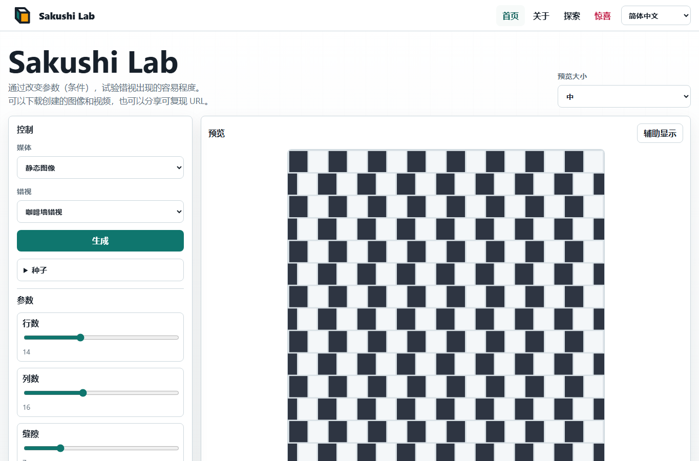
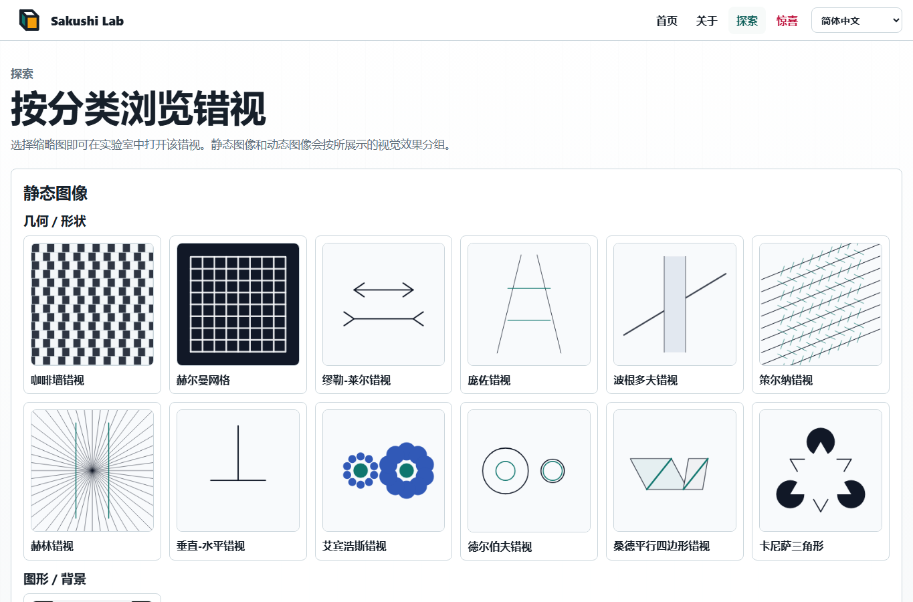

# Sakushi Lab

Sakushi Lab 是一个静态、多语言的视觉错觉实验场。它完全在浏览器中运行，使用 Vite、vanilla TypeScript、Canvas、SVG 导出和 WebM 录制。

在线站点：[Sakushi Lab](https://piccoripico.github.io/sakushi-lab/)

## 多语言文档

- [English](../README.md)
- [日本語](README.ja.md)
- [Français](README.fr.md)
- [Español](README.es.md)
- [Deutsch](README.de.md)
- [繁體中文](README.zh-Hant.md)
- [한국어](README.ko.md)

## 屏幕截图

### Home



### Explore



## 关于视觉错觉

视觉错觉是图像或运动图案，用来展示知觉会在多大程度上依赖上下文。物理上平行的线可能看起来倾斜，相同大小的形状可能显得不同，静止图案也可能让人感觉闪烁或移动。

这些效果并不只是视觉的“错误”。它们说明视觉系统会根据周围信息估计亮度、对比度、深度、方向、大小和运动。Sakushi Lab 可以让你改变每种错觉的条件，观察效果如何变强、变弱或更容易被注意到。

生成的图像和视频可用于学习、演示、设计实验和日常探索。一些运动错觉可能刺激较强；如果动画让你不舒服，请休息一下。

## 功能

- 18 种视觉错觉：
  - 静止图像
    - 几何 / 形状：
      - 咖啡墙错觉：错位的瓷砖让平行线看起来倾斜。
      - 赫尔曼网格：网格交点会产生短暂的暗点。
      - 缪勒-莱尔错觉：箭羽改变等长线段的感知长度。
      - 庞佐错觉：透视线索让相同横条看起来大小不同。
      - 波根多夫错觉：遮挡带让斜线看起来错位。
      - 佐尔纳错觉：交叉短线让平行线看起来倾斜。
      - 黑林错觉：放射线让直线平行线看起来向外弯曲。
      - 垂直-水平错觉：等长的竖线和横线会显得不等长。
      - 艾宾浩斯错觉：周围圆会改变中心圆的感知大小。
      - 德尔布夫错觉：周围环会改变相同圆的感知大小。
      - 桑德平行四边形错觉：倾斜框架会扭曲线段长度感。
      - 卡尼萨三角形：缺口圆和角形暗示出没有画出的三角形。
    - 图形 / 背景：
      - 鲁宾花瓶：花瓶和两张侧脸会在图形与背景之间竞争。
    - 颜色 / 亮度：
      - 同时对比：相同颜色会因周围环境而显得不同。
      - 怀特错觉：相同灰色条在条纹上看起来不同。
      - 科恩斯威特错觉：细窄阴影边界会改变亮度感。
  - 视频
    - 运动 / 后像图案：
      - 紫丁香追逐者：旋转缺口会产生移动后像感。
    - 可反转深度：
      - 旋转内克尔立方体：运动会突出线框立方体的深度翻转。
- 根据每个错觉模块的 schema 生成参数控制。
- 可选的种子控制，用于可重复生成。
- 通过带种子的 URL 进行确定性生成和分享。
- 导出 PNG、SVG、WebM 和可复现 URL。
- UI 语言：英语、法语、西班牙语、德语、日语、简体中文、繁体中文和韩语。

## 开发

```powershell
npm.cmd install
npm.cmd run verify
```

常用脚本：

- `npm.cmd run dev`：启动 Vite 开发服务器。
- `npm.cmd test`：运行单元测试。
- `npm.cmd run build`：进行类型检查并构建 `dist/`。
- `npm.cmd run test:e2e`：运行 Playwright 测试。

## GitHub Pages

`.github/workflows/pages.yml` 中的 workflow 会在推送到 `main` 或手动触发时构建 `dist/`，并将其作为 Pages artifact 上传。
